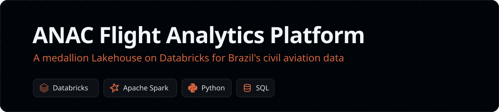
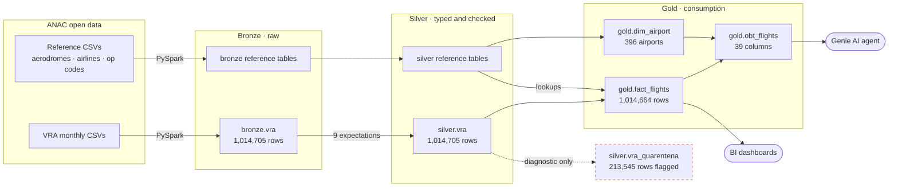
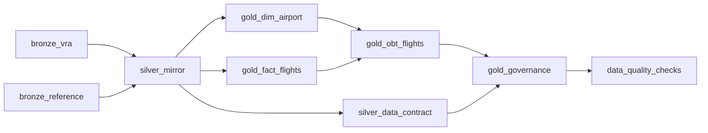

An end to end aviation **data Lakehouse on Databricks** that turns ANAC's public flight records into decision ready analytics. Over **1 million flights** move through an idempotent **medallion architecture** (bronze → silver → gold), where a declarative data quality framework of **9 expectations** isolates **21% of anomalous records** into a diagnostic quarantine without losing a single row.

The gold layer follows a **dual model design**, combining a Kimball dimensional model for BI workloads with a **39 column One Big Table** engineered for natural language to SQL agents (Databricks Genie). Everything is governed by **Unity Catalog**, with end to end lineage, tags and complete column documentation that grounds the AI semantically, and the full pipeline refreshes in **under two minutes** on serverless compute.

**Contents:** [Architecture](#architecture-overview) · [Key Findings](#key-findings) · [Quick Start](#quick-start) · [Testing](#testing) · [Decisions](#architectural-decisions) · [Data Quality](#data-quality--validation-strategy) · [Deep Dives](#deep-dives) · [Lessons Learned](#lessons-learned) · [Limitations](#known-limitations) · [Roadmap](#roadmap) · [Data Sources](#data-sources)

---

## Architecture Overview

The platform follows the **medallion architecture** (bronze → silver → gold), a pattern popularized by Databricks that applies progressive data refinement. Each layer has a single, non-overlapping responsibility.



| Layer | Responsibility | Format | Pattern | Row Count |
|-------|---------------|--------|---------|-----------|
| **Bronze** | Raw ingestion, zero transformation, all-string schema | Delta (full refresh) | Append-only landing | 1,014,705 (VRA) |
| **Silver** | Type casting, column renaming, enrichment flags, quarantine | Delta (CREATE OR REPLACE) | Lossless mirror + DQ | 1,014,705 (VRA) |
| **Gold** | Fact table + airport dimension, plus a denormalized OBT for AI consumption | Delta (CREATE OR REPLACE) | Kimball fact/dim + OBT | 1,014,664 (OBT) |

### Design Philosophy

The architecture draws on two complementary traditions:

- **Medallion (Databricks):** Progressive refinement through bronze → silver → gold, with each layer serving a distinct consumer. Bronze is for engineers debugging ingestion; silver is for analysts exploring cleaned data; gold is for business consumption.
- **Kimball dimensional modeling:** The gold layer maintains a dimensional model (`fact_flights` + `dim_airport`) for traditional BI consumption, following Ralph Kimball's principle that dimensions should be conformed and re-usable.

The OBT (`obt_flights`) is a deliberate departure from pure Kimball — it denormalizes the dimensional model into a single wide table to eliminate join reasoning for LLM-based consumers. This dual-model approach (dimensional model + OBT) lets us serve both human analysts and AI agents from the same gold layer.

---

## Key Findings

- **Three airlines carry the market.** TAM, AZU and GLO account for **83.3%** of all flight records.
- **Delays are often recovered in the air.** **645,914** flight steps arrived less delayed than they departed.
- **One in five records needs care.** **21.05%** of rows fail at least one data quality rule, mostly missing scheduled times and foreign carriers outside the ANAC registry.
- **International routes are real, not errors.** **22%** of destination codes are foreign airports, handled with a fallback name in `dim_airport`.
- **Summer peaks.** December and January are the busiest months (85,452 and 88,965 flights), February the quietest (77,136).

---

## Quick Start

### Prerequisites

- Databricks workspace with Serverless compute enabled
- Unity Catalog: `airline_operations` catalog with `bronze`, `silver`, `gold` schemas
- UC Volume: `airline_operations.bronze.data` containing ANAC CSV files
- Git credential linked to this repository

### Deploy and Run

The whole pipeline ships as a **Databricks Asset Bundle** (`databricks.yml`). One command deploys a job with every step wired as a dependency graph, plus the Spark Declarative Pipeline that runs the data contract.

```bash
databricks bundle validate
databricks bundle deploy -t dev
databricks bundle run anac_pipeline -t dev
```



The job is scheduled for the 5th of each month (ANAC publishes VRA monthly) and ships **paused**, so it only runs when you unpause it. Every notebook is idempotent (`CREATE OR REPLACE` / `mode("overwrite")`), so any task can be safely rerun.

> If the data contract pipeline was created by hand before, delete it once so the bundle can take ownership of `silver.vra_quarentena`.

<details>
<summary><b>Run the notebooks manually instead</b></summary>

| Step | Notebook | Action |
|------|----------|--------|
| 1 | `src/bronze/01_ingest_vra.py` | Ingest VRA CSVs → `bronze.vra` |
| 2 | `src/bronze/02_ingest_reference_data.py` | Ingest aerodromes, airlines, op codes → `bronze.*` |
| 3 | `src/silver/01_silver_mirror.py` | Type-cast, enrich, rename → `silver.*` |
| 4 | `src/silver/transformations/01-03_*.sql` | SDP pipeline: mark → audit → quarantine |
| 5 | `src/gold/02_gold_dim_airport.py` | Build airport dimension |
| 6 | `src/gold/03_gold_fact_flights.py` | Build fact table with business rules |
| 7 | `src/gold/01_gold_obt_flights.py` | Build denormalized OBT |
| 8 | `src/gold/04_gold_governance.py` | Apply comments, tags, run validation |
| 9 | `src/checks/data_quality_checks.py` | Post-load quality gate |

</details>

------|----------|--------|
| 1 | `src/bronze/01_ingest_vra.py` | Ingest VRA CSVs → `bronze.vra` |
| 2 | `src/bronze/02_ingest_reference_data.py` | Ingest aerodromes, airlines, op codes → `bronze.*` |
| 3 | `src/silver/01_silver_mirror.py` | Type-cast, enrich, rename → `silver.*` |
| 4 | `src/silver/transformations/01-03_*.sql` | SDP pipeline: mark → audit → quarantine |
| 5 | `src/gold/02_gold_dim_airport.py` | Build airport dimension |
| 6 | `src/gold/03_gold_fact_flights.py` | Build fact table with business rules |
| 7 | `src/gold/01_gold_obt_flights.py` | Build denormalized OBT |
| 8 | `src/gold/04_gold_governance.py` | Apply comments, tags, run validation |

Each notebook is idempotent (`CREATE OR REPLACE` / `mode("overwrite")`) and can be re-run safely.

---

## Repository Structure

```
anac-data-platform/
├── src/
│   ├── bronze/
│   │   ├── README.md
│   │   ├── 01_ingest_vra.py              # VRA CSV → bronze.vra (full refresh)
│   │   └── 02_ingest_reference_data.py   # Aerodromes, airlines, op codes → bronze.*
│   ├── silver/
│   │   ├── README.md
│   │   ├── 01_silver_mirror.py           # Bronze → silver (typed, enriched, renamed)
│   │   └── transformations/
│   │       ├── 01_vra_marked.sql          # Enrichment flags (ANAC registry joins)
│   │       ├── 02_vra_audited.sql         # Data contract: 9 expectations (warn mode)
│   │       └── 03_vra_quarantine.sql       # Diagnostic quarantine materialized view
│   └── gold/
│       ├── README.md
│       ├── 01_gold_obt_flights.py         # One Big Table (denormalized, 39 cols)
│       ├── 02_gold_dim_airport.py         # Dimension: airports (unified origin/dest)
│       ├── 03_gold_fact_flights.py        # Fact: flight steps with resolved FKs
│       └── 04_gold_governance.py          # Column comments, UC tags, validation
├── src/checks/
│   └── data_quality_checks.py             # Post-load quality gate (last job task)
├── tests/                                 # pytest suite running the notebooks' SQL
├── resources/
│   └── anac_pipeline.yml                  # Job + data contract pipeline definition
├── .github/workflows/ci.yml               # Runs the tests on every push
├── assets/                                # README header
├── docs/
│   └── data_catalog.py                    # Notebook-format data dictionary
├── databricks.yml                         # Asset Bundle (dev and prod targets)
├── requirements-dev.txt
├── pytest.ini
├── .gitignore
└── README.md
```

---

## Testing

Quality is enforced at two levels.

**Transformation tests (CI).** `tests/` holds 18 pytest cases that run on a local Spark session in GitHub Actions on every push and pull request. They do not reimplement the logic. They extract the **exact SQL the notebooks execute** and run it against small handcrafted fixtures, so a change to a business rule in a notebook is caught before it reaches Databricks.

| Area | What is verified |
|------|------------------|
| Silver mirror | Row count preserved, literal `'null'` strings become real NULLs, delay and recovery arithmetic |
| Gold fact | Exact duplicates removed, 15 minute punctuality boundary, implausible delays nulled not dropped, flight scope, airline fallback names, active registry record wins |
| Quarantine | Clean flights stay out, every broken rule is listed, foreign airports are flagged |

```bash
pip install -r requirements-dev.txt
pytest
```

**Quality gate after every load (Databricks).** The last job task, `src/checks/data_quality_checks.py`, checks the invariants across layers on the real data and **fails the run** if any breaks. It verifies that silver mirrors bronze, that gold drops only exact duplicates, that the OBT keeps every fact row, that the fact grain is unique, that every origin airport exists in `dim_airport`, that punctuality follows the 15 minute rule, that the quarantine stays diagnostic and that gold tables carry their tags.

---

## Architectural Decisions

### 1. Warn Mode over Fail Mode in Data Quality

**Decision:** All nine SDP expectations in `02_vra_audited.sql` run in `WARN` mode, not `FAIL`.

**Rationale:** The silver layer functions as a lossless mirror of bronze — row counts must match exactly (1,014,705 → 1,014,705). Fail mode would drop rows that violate expectations, breaking this invariant and silently shrinking the dataset. Warn mode logs violations for observability while preserving every record.

The quarantine view (`03_vra_quarantine.sql`) captures which rows violated which constraints, enabling downstream business decisions about exclusion at the gold layer — not the silver layer. Currently, 213,545 rows (21.05%) fail at least one expectation. The top violation categories are missing scheduled times and airlines not in the ANAC registry (foreign carriers).

**Impact:** `silver.vra` row count == `bronze.vra` row count, always. Quality issues are diagnosed, not hidden. Business rules about exclusion are applied at gold, not silver.


**Trade-off:** Quarantined rows (21%) remain in `silver.vra`, so consumers must know that not every row passes every check.

### 2. OBT (One Big Table) alongside Star Schema

**Decision:** Maintain both a dimensional model (`fact_flights` + `dim_airport`) and a denormalized OBT (`obt_flights`).

**Current scope:** `dim_airport` is the only conformed dimension today. Airline, flight type and date attributes are still carried inside `fact_flights`; splitting them into `dim_airline` and `dim_date` is on the [roadmap](#roadmap).

**Rationale:** The dimensional model serves traditional BI consumption (Tableau, Power BI) where modelers expect separable dimensions, following Kimball's dimensional modeling principles. The OBT serves AI consumption via Genie Agent, where join-free access eliminates the need for an LLM to understand table relationships — every column the agent might need is in a single flat table.

This dual-model approach costs ~15 MB of additional storage (the OBT duplicates the fact table's data with resolved dimension attributes). At 1M rows, this is negligible; the OBT rebuild takes seconds.

**Impact:** Genie Agent can answer any business question with a single-table `SELECT` — no `JOIN` clauses, no foreign-key reasoning, no schema discovery overhead.


**Trade-off:** ~15 MB of duplicated storage, and a dimension change requires rebuilding the OBT, not just the dimension.

### 3. Python for Ingestion, SQL for Transformation

**Decision:** Bronze ingestion uses PySpark; silver/gold transformations use SQL (with SDP declarations in pure SQL).

**Rationale:** Bronze ingestion requires file-system interaction (`spark.read.csv` with delimiter/encoding options, `_metadata` column extraction) that is more expressive in Python. Silver and gold layers are declarative set transformations — SQL is the natural language for this, and it makes the transformation logic readable, auditable, and portable. The SDP expectations in SQL are also reviewable by data stewards who may not know Python.

**Impact:** Two skill sets required to maintain the pipeline. Each layer uses the most expressive tool. A pure-SQL approach would require complex CSV parsing workarounds; a pure-Python approach would bury transformation logic inside DataFrame API calls that are harder to audit.

### 4. Full Refresh over Incremental (CDC)

**Decision:** All layers use `CREATE OR REPLACE` / `mode("overwrite")` rather than incremental merge.

**Rationale:** The dataset is ~1M rows and ~11–20 MB per layer. At this scale, full refresh completes in under 2 minutes and eliminates the complexity of change detection, deduplication, and merge conflicts.

**Impact:** Idempotent and simple — no merge-conflict risk. When the dataset grows beyond ~10M rows, the bronze layer can adopt Auto Loader with incremental merge; silver and gold can switch to `MERGE INTO` with minimal code changes. See the [Roadmap](#roadmap) for the planned evolution.

**Trade-off:** O(n) scan on every refresh, not suitable beyond ~10M rows without moving to incremental loads.

### 5. Databricks over Snowflake / BigQuery

**Decision:** Built on Databricks Lakehouse.

**Rationale:**
- **Unity Catalog** provides centralized governance (tags, column comments, lineage) that Genie Agent reads natively for semantic understanding.
- **Genie Agent** integration — the OBT is designed for NL2SQL consumption; Databricks Genie reads UC metadata (tags, comments) to generate accurate queries. Snowflake Cortex and BigQuery Gemini offer AI features but lack the same tight coupling between catalog metadata and the LLM.
- **Delta Lake** provides ACID guarantees, time travel, and schema evolution out of the box.
- **Serverless compute** auto-scales for both pipeline execution and ad-hoc Genie queries without cluster management.
- **Spark Declarative Pipelines (SDP)** enables declarative data quality expectations in SQL, a pattern that dbt also supports but requires a separate orchestration layer.

**Trade-off:** Databricks is more expensive than BigQuery for pure storage at scale, and Snowflake has a lower learning curve for SQL-first teams. The decision is justified by the Genie Agent integration and UC-native governance.

### 6. Portuguese as the Semantic Language

**Decision:** All column comments, table descriptions, and business terminology are in Portuguese.

**Rationale:** The data source (ANAC) is Brazilian, the primary consumers are Brazilian, and the Genie Agent is expected to receive questions in Portuguese (e.g., *"Qual companhia teve mais atrasos?"*). Portuguese column comments enable the agent to map natural-language questions to the correct columns. This is not a localization add-on — it is the primary language of the semantic layer.

**Impact:** Column comments must be maintained in Portuguese. Code and documentation are in English; business semantics are in Portuguese. This mirrors how many international data teams operate: code is universal, business context is local.

---

## Data Quality & Validation Strategy

### Data Contract (Silver Layer)

Nine expectations defined in `02_vra_audited.sql`, all in **warn mode**:

| # | Expectation | Rule | Business Meaning |
|---|-------------|------|------------------|
| 1 | `horarios_previstos_presentes` | `scheduled_departure IS NOT NULL AND scheduled_arrival IS NOT NULL` | Scheduled times must exist |
| 2 | `situacao_voo_conhecida` | `flight_status IN ('REALIZADO', 'CANCELADO')` | Status must be a known value |
| 3 | `chegada_prevista_depois_da_partida_prevista` | `scheduled_arrival > scheduled_departure` | Arrival can't precede departure |
| 4 | `chegada_real_depois_da_partida_real` | `actual_arrival > actual_departure` | Same for actual times |
| 5 | `atraso_partida_plausivel` | `departure_delay_min BETWEEN -120 AND 1440` | Delays within plausible range (±2h to +24h) |
| 6 | `atraso_chegada_plausivel` | `arrival_delay_min BETWEEN -120 AND 1440` | Same for arrivals |
| 7 | `empresa_no_cadastro_anac` | `empresa_no_cadastro = TRUE` | Airline exists in ANAC registry |
| 8 | `aeroporto_origem_no_cadastro_anac` | `origem_no_cadastro = TRUE` | Origin airport in ANAC registry |
| 9 | `aeroporto_destino_no_cadastro_anac` | `destino_no_cadastro = TRUE` | Destination airport in ANAC registry |

### Current Data Quality Metrics

| Metric | Value | Notes |
|--------|-------|-------|
| Total rows (silver.vra) | 1,014,705 | Matches bronze exactly |
| Quarantined rows | 213,545 (21.05%) | Fail >=1 expectation |
| Missing scheduled times | 30,800 rows | Flights without scheduled departure/arrival |
| Unknown flight status | 0 | All rows have REALIZADO or CANCELADO |
| Implausible delays (outside ±2h to +24h) | 778 rows | Nullified in gold, not dropped |
| Duplicate rows (removed in gold) | 41 | Exact-match deduplication in fact_flights |

### Quarantine Strategy

`03_vra_quarantine.sql` creates a materialized view that mirrors every row that failed at least one expectation, annotated with a `motivos_quarentena` column containing the pipe-delimited list of violated constraint names. This is **diagnostic, not corrective** — `silver.vra` retains all rows; the decision to exclude specific categories is deferred to the gold layer and driven by business rules.

### Gold Layer Validation

`04_gold_governance.py` runs post-load validation:
- **Documentation coverage:** Every column in silver and gold must have a non-empty comment (currently 100% coverage, excluding system event-log tables).
- **Tag audit:** Every gold table carries five UC tags: `layer`, `domain`, `grain`, `pattern`, `consumption`.
- **Lineage check:** Queries `system.access.table_lineage` to verify the full bronze -> silver -> gold chain.
- **Delay recovery analysis:** Validates that `minutes_recovered` is consistent with delay arithmetic (645,914 rows recovered time in flight).

### Idempotency

Every notebook is idempotent:
- Bronze uses `mode("overwrite")` with `overwriteSchema=true`
- Silver and gold use `CREATE OR REPLACE TABLE`
- SDP uses `CREATE OR REFRESH MATERIALIZED VIEW`
- Re-running any notebook produces the same result without side effects

---

## Deep Dives

<details>
<summary><b>Performance & Scalability</b></summary>

### Current Data Volume

| Table | Rows | Size (MB) | Files | Columns |
|-------|-----:|----------:|------:|--------:|
| `bronze.vra` | 1,014,705 | 11.07 | 3 | 14 |
| `silver.vra` | 1,014,705 | 20.01 | 1 | 26 |
| `silver.aerodromes` | 496 | 0.02 | 1 | 13 |
| `silver.airlines` | 877 | 0.02 | 2 | 11 |
| `silver.operation_codes` | 13 | <0.01 | 1 | 4 |
| `gold.obt_flights` | 1,014,664 | 15.61 | 1 | 39 |
| `gold.fact_flights` | 1,014,664 | 15.28 | 1 | 31 |
| `gold.dim_airport` | 396 | 0.01 | 1 | 7 |

**Total lakehouse footprint:** ~62 MB across 8 Delta tables.

### Data Window

August 2025 – August 2026 (12 months, 366 distinct flight dates).

### Growth Projections

| Timeframe | Estimated Rows (VRA) | Estimated Size | Strategy |
|-----------|---------------------:|----------------:|----------|
| Current (12 months) | 1,014,705 | ~62 MB | Full refresh |
| +12 months (24 total) | ~2,000,000 | ~120 MB | Full refresh |
| +24 months (36 total) | ~3,000,000 | ~180 MB | Full refresh (monitor) |
| +36 months (48 total) | ~4,000,000 | ~250 MB | Partitioning by month |
| +48 months (60 total) | ~5,000,000 | ~310 MB | Auto Loader + incremental merge |

At the current rate of ~82K flights/month (excluding null dates), the 10M row inflection point is reached in approximately 10 years. Full refresh remains optimal well beyond that for this dataset.

### Query Latency (OBT)

Aggregation queries against `gold.obt_flights` on serverless compute:

| Metric | Latency |
|--------|---------|
| P50 | ~1.0 s |
| P95 | ~8.5 s (includes cold-start) |
| Steady-state | <1.2 s |

*Measured with 5 consecutive `GROUP BY flight_status` aggregations on serverless SQL. Cold-start outlier (8.5 s) reflects cluster spin-up; steady-state queries are sub-second.*

### Data Skew Analysis

The top 3 airlines account for 83.3% of all flight records:

| Airline | Rows | Share | Implication |
|---------|-----:|------:|-------------|
| TAM | 302,082 | 29.8% | Largest carrier — skew source |
| AZU | 284,141 | 28.0% | |
| GLO | 259,304 | 25.5% | |
| Others (44 carriers) | 169,178 | 16.7% | Long tail of foreign airlines |

**Implication:** At the current scale, skew is irrelevant — single-file scans complete in <1s. At >10M rows, partitioning by `icao_airline` would create hot partitions for TAM/AZU/GLO. Liquid clustering on `icao_airline` + `scheduled_departure_date` is the planned mitigation (see the [Roadmap](#roadmap)).

### Monthly Distribution

Monthly volume is stable at ~80K flights/month with no significant seasonality outliers. February is the lowest month (77,136), December and January are the highest (85,452 and 88,965), consistent with Brazilian summer holiday travel patterns.

### Cost Estimation (Serverless)

| Scenario | DBUs | Monthly Cost |
|----------|-----:|-------------:|
| 1 full refresh/month | 0.07 | ~$0.01 |
| Daily full refresh | 2.1 | ~$0.14 |
| Daily refresh + 1K Genie queries | 502 | ~$35 |

*Based on serverless all-purpose rate ($0.07/DBU). Pipeline runs ~2 min on serverless. Genie queries average ~0.5 DBU each. At this scale, cost is negligible — storage ($0.02/GB/month) and compute together cost less than a coffee.*

### Partitioning Strategy

No partitioning or liquid clustering is currently applied. At <1M rows and <16 MB per table, full scans are faster than partition pruning overhead. When the dataset exceeds ~5M rows, partitioning by `reference_month` or liquid clustering on `icao_airline` + `scheduled_departure_date` is the planned evolution.

### Pipeline End-to-End

Full bronze -> silver -> gold refresh completes in **under 2 minutes** on serverless compute, including governance and validation.

</details>

<details>
<summary><b>Lineage & Governance</b></summary>

### Unity Catalog Tags

Every table across all layers carries standardized UC tags:

| Tag | Values | Purpose |
|-----|--------|---------|
| `layer` | `bronze`, `silver`, `gold` | Medallion positioning |
| `domain` | `aviation` | Business domain |
| `grain` | `flight_step`, `aerodrome`, `company`, `code`, `airport` | Row-level granularity |
| `source` | `ANAC-VRA`, `ANAC-Aerodromos`, `ANAC-Operador-Aereo`, `ANAC-seed` | Origin system |
| `pattern` | `fact`, `dimension`, `obt` | Modeling pattern (gold only) |
| `consumption` | `bi`, `genie` | Target consumer (gold only) |

### Lineage Tracking

Upstream/downstream dependencies are tracked via `system.access.table_lineage`:

```
Volume (CSV) --> bronze.vra --> silver.vra --> gold.fact_flights --> gold.obt_flights
                                           |-> gold.dim_airport  -->|
Volume (CSV) --> bronze.aerodromos --> silver.aerodromes -->|
Volume (CSV) --> bronze.*_airlines --> silver.airlines -->|
Volume (CSV) --> bronze.operation_codes --> silver.operation_codes -->|
```

The governance notebook (`04_gold_governance.py`) queries this system table to verify the full chain is intact after each gold rebuild.

### Delta Versioning & Time Travel

All Delta tables have **deletion vectors enabled** and **column mapping mode** set to `name`, supporting:
- Time travel via `VERSION AS OF` and `TIMESTAMP AS OF`
- Schema evolution without breaking downstream consumers
- ACID guarantees with optimistic concurrency control

Current version counts: `bronze.vra` (16), `silver.vra` (28), `gold.obt_flights` (81) — reflecting iterative development. In production, versions will accumulate at 1/month (one refresh cycle).

### Retention Policy

| Component | Default | Rationale |
|-----------|---------|-----------|
| Delta log retention | 30 days | Sufficient for rollback within a billing cycle |
| Deleted file retention | 7 days | Allows `VACUUM` without breaking time travel |
| Bronze data | Indefinite (raw landing) | Source of truth — never compacted |
| Silver data | Indefinite (mirror) | Rebuilt from bronze on each refresh |
| Gold data | Indefinite | Rebuilt from silver on each refresh |
| Volume CSVs | Indefinite | ANAC public data — no expiry needed |

### Access Control

| Principal | Bronze | Silver | Gold | Volume |
|-----------|--------|--------|------|--------|
| Data Engineer | `ALL` | `ALL` | `ALL` | `ALL` |
| Analyst | `SELECT` | `SELECT` | `SELECT` | — |
| Genie Agent | — | — | `SELECT` | — |
| Public (future) | — | — | `SELECT` (via share) | — |

*Note: Access control is managed via Unity Catalog grants. Current setup uses catalog-level `USE` and schema-level `SELECT` / `ALL` privileges.*

### Compliance

- **Data source:** ANAC public open data — no PII, no licensing restrictions
- **Storage region:** Databricks workspace region (configured at deployment)
- **Cross-border transfer:** Not applicable (Brazilian public data, stored in-region)
- **Data classification:** Public (suitable for open sharing via Delta Sharing)

### Change Management

1. All changes via pull request
2. Schema changes must preserve backward compatibility (column mapping mode = name)
3. New columns require UC comments in Portuguese
4. New tables require UC tags
5. Breaking changes require version bump and migration guide

### Column Documentation

100% of silver and gold columns have non-empty UC comments in Portuguese (for Genie Agent compatibility). Comments describe business semantics, not just column names — e.g., `minutes_recovered`: *"Minutos que a etapa recuperou no ar: atraso de partida menos atraso de chegada. Positivo significa que chegou MENOS ATRASADA do que saiu, e NAO que chegou no horario."*

### Audit Trail

- **Schema changes:** Tracked via Delta transaction log (`DESCRIBE HISTORY`)
- **Data changes:** Tracked via Delta versions (time travel)
- **Access:** Tracked via `system.access.table_lineage` and `system.access.audit`
- **Code changes:** Tracked via Git (this repository)

### SLA & Alerting

| Metric | Target | Alert |
|--------|--------|-------|
| Pipeline completion | < 5 min | Databricks job timeout |
| Row count (bronze -> silver) | Exact match | Governance notebook validation query |
| Row count (silver -> gold) | <= 41 row difference (dedup) | Governance notebook validation query |
| Column comment coverage | 100% | Governance notebook validation query |
| Tag coverage | 100% | Governance notebook validation query |
| Genie query latency P50 | < 2 s | Serverless compute metrics |

*Note: The post-load quality gate fails the job when an invariant breaks. Notifications on that failure (email or Slack) are on the [Roadmap](#roadmap).*

</details>

<details>
<summary><b>Use Cases & Query Patterns</b></summary>

### Punctuality Analysis

```sql
SELECT
    airline_name,
    COUNT(*) AS flights,
    AVG(departure_delay_min) AS avg_dep_delay,
    AVG(arrival_delay_min) AS avg_arr_delay,
    SUM(CAST(departure_punctual AS INT)) * 100.0 / COUNT(*) AS dep_on_time_pct
FROM airline_operations.gold.obt_flights
WHERE flight_status = 'REALIZADO'
GROUP BY airline_name
ORDER BY dep_on_time_pct DESC;
```

### Route Performance

```sql
SELECT
    route_municipalities,
    COUNT(*) AS flights,
    AVG(minutes_recovered) AS avg_minutes_recovered
FROM airline_operations.gold.obt_flights
WHERE flight_status = 'REALIZADO'
GROUP BY route_municipalities
ORDER BY flights DESC
LIMIT 10;
```

### Cancellation Analysis

```sql
SELECT
    airline_name,
    COUNT(*) AS flights,
    SUM(CAST(flight_cancelled AS INT)) AS cancelled,
    SUM(CAST(flight_cancelled AS INT)) * 100.0 / COUNT(*) AS cancel_pct
FROM airline_operations.gold.obt_flights
GROUP BY airline_name
ORDER BY cancelled DESC
LIMIT 10;
```

### Monthly Trend

```sql
SELECT
    reference_month,
    flight_status,
    COUNT(*) AS flights,
    AVG(arrival_delay_min) AS avg_delay
FROM airline_operations.gold.obt_flights
GROUP BY reference_month, flight_status
ORDER BY reference_month, flight_status;
```

### Hourly Delay Cascade

```sql
SELECT
    scheduled_departure_hour,
    AVG(departure_delay_min) AS avg_dep_delay,
    AVG(arrival_delay_min) AS avg_arr_delay,
    COUNT(*) AS flights
FROM airline_operations.gold.obt_flights
WHERE flight_status = 'REALIZADO'
  AND departure_delay_min IS NOT NULL
GROUP BY scheduled_departure_hour
ORDER BY scheduled_departure_hour;
```

</details>

<details>
<summary><b>Consumption Patterns (Genie Agent & BI)</b></summary>

### Genie Agent (NL2SQL)

The OBT (`gold.obt_flights`) is the primary table for Genie Agent. It is tagged `consumption = 'genie'` to signal that this is the AI-optimized surface. The table's design follows three principles for LLM-friendly schemas:

1. **Self-describing column names:** `airline_name`, `origin_municipality`, `departure_delay_min` — no abbreviations, no joins needed to resolve meaning.
2. **Pre-computed metrics:** `departure_punctual`, `arrival_punctual`, `minutes_recovered`, `delay_out_of_range` — the agent does not need to derive business logic; it filters and aggregates.
3. **Portuguese column comments:** Genie Agent reads UC comments to understand semantics. Every column carries a business definition in Portuguese, enabling the agent to map natural-language questions to the correct columns.

**Example queries the Genie Agent can generate:**

| Natural Language (PT) | Generated SQL Pattern |
|------------------------|----------------------|
| *"Qual companhia aérea teve mais atrasos em São Paulo?"* | `WHERE origin_municipality LIKE '%São Paulo%' ... GROUP BY airline_name` |
| *"Qual rota tem maior taxa de cancelamento?"* | `WHERE flight_cancelled = TRUE ... GROUP BY route_icao` |
| *"Qual o tempo médio de recuperação de atrasos por mês?"* | `AVG(minutes_recovered) ... GROUP BY reference_month` |
| *"Quantos voos foram cancelados por companhia estrangeira?"* | `WHERE airline_registry = 'foreign' AND flight_cancelled = TRUE ... GROUP BY airline_name` |
| *"Qual o pior horário para voar em termos de atraso?"* | `AVG(departure_delay_min) ... GROUP BY scheduled_departure_hour` |

### Schema Constraints for LLM Reasoning

| Constraint | Implementation | Benefit |
|-----------|---------------|---------|
| Single-table access | OBT contains all 39 needed columns | No JOIN reasoning required |
| No ambiguous synonyms | Each concept maps to exactly one column | Eliminates column-selection errors |
| Boolean flags pre-computed | `departure_punctual`, `flight_cancelled` | Agent avoids complex CASE logic |
| Human-readable values | `flight_status = 'REALIZADO'` not `1` | Agent can match natural language |
| Route as single column | `route_icao`, `route_municipalities` | No need to concatenate origin + destination |
| Nullability documented | Comments explain when/why values are NULL | Agent avoids counting nulls as delays |

### BI Consumption

The dimensional model (`fact_flights` + `dim_airport`) supports traditional BI tools. `fact_flights` is tagged `consumption = 'bi'` and maintains normalized foreign keys for modelers who prefer star-join patterns.

</details>

<details>
<summary><b>Runbook (troubleshooting, rollback and health checks)</b></summary>

#### Pipeline Failure

##### Symptom: Bronze ingestion fails with "Path does not exist"
**Cause:** ANAC CSV files not loaded into the UC volume.
**Fix:**
1. Check `/Volumes/airline_operations/bronze/data/VRA/` for VRA files
2. Check `/Volumes/airline_operations/bronze/data/references/` for reference files
3. Download missing files from [dados.gov.br](https://dados.gov.br)
4. Re-run `src/bronze/01_ingest_vra.py`

##### Symptom: Silver row count != bronze row count
**Cause:** Unexpected filtering in the silver mirror SQL.
**Fix:**
1. Run `SELECT COUNT(*) FROM airline_operations.bronze.vra` and `SELECT COUNT(*) FROM airline_operations.silver.vra`
2. If different, check `01_silver_mirror.py` for accidental `WHERE` clauses
3. Silver must be a lossless mirror — re-run the notebook

##### Symptom: Quarantine view shows 0 rows
**Cause:** SDP pipeline not run after silver rebuild.
**Fix:**
1. Run `src/silver/transformations/01_vra_marked.sql` first
2. Then `02_vra_audited.sql` (creates the expectation contract)
3. Then `03_vra_quarantine.sql` (materializes the quarantine view)
4. Verify: `SELECT COUNT(*) FROM airline_operations.silver.vra_quarentena` should return ~213K

##### Symptom: Gold OBT has fewer rows than fact_flights
**Cause:** Dimension join dropped rows (should not happen — all joins are LEFT JOIN).
**Fix:**
1. Check `SELECT COUNT(*) FROM airline_operations.gold.fact_flights` vs `gold.obt_flights`
2. If different, verify dim_airport has all ICAO codes: `SELECT COUNT(DISTINCT icao_airport) FROM gold.dim_airport`
3. Re-run `01_gold_obt_flights.py`

##### Symptom: Governance notebook reports missing column comments
**Cause:** New column added without a comment.
**Fix:**
1. Identify the column: `SELECT table_schema, table_name, column_name FROM airline_operations.information_schema.columns WHERE table_schema IN ('silver','gold') AND (comment IS NULL OR comment = '')`
2. Add a comment: `ALTER TABLE airline_operations.{schema}.{table} ALTER COLUMN {col} COMMENT '...'`
3. Re-run `04_gold_governance.py`

##### Symptom: Genie Agent generates incorrect SQL
**Cause:** Missing or unclear column comments, or table not tagged `consumption = 'genie'`.
**Fix:**
1. Verify `gold.obt_flights` has tag `consumption = 'genie'`
2. Check all 39 columns have non-empty Portuguese comments
3. Test with a simple question: "Quantos voos foram cancelados?"
4. If still wrong, check if the Genie space is configured to use `airline_operations.gold` schema

#### Rollback Strategy

##### Roll back a table to a previous version
```sql
-- Find available versions
DESCRIBE HISTORY airline_operations.gold.obt_flights;

-- Roll back to version N
RESTORE TABLE airline_operations.gold.obt_flights TO VERSION AS OF N;
```

##### Roll back the entire pipeline
1. Restore bronze tables to previous version (if needed)
2. Re-run silver and gold notebooks — they are idempotent and will rebuild from the restored bronze
3. Run governance notebook to validate

#### Monitoring Endpoints

| Check | Query | Expected |
|-------|-------|----------|
| Bronze row count | `SELECT COUNT(*) FROM airline_operations.bronze.vra` | ~1,014,705 |
| Silver = Bronze | `SELECT (SELECT COUNT(*) FROM bronze.vra) - (SELECT COUNT(*) FROM silver.vra)` | 0 |
| Gold = Silver - dedup | `SELECT (SELECT COUNT(*) FROM silver.vra) - (SELECT COUNT(*) FROM gold.fact_flights)` | 41 |
| Quarantine exists | `SELECT COUNT(*) FROM silver.vra_quarentena` | ~213,545 |
| Comment coverage | `SELECT COUNT(*) FROM information_schema.columns WHERE table_schema IN ('silver','gold') AND (comment IS NULL OR comment = '')` | 0 |
| Tag coverage | `SELECT COUNT(*) FROM information_schema.tables WHERE table_schema = 'gold' AND table_name NOT IN (SELECT table_name FROM information_schema.table_tags WHERE tag_name = 'consumption')` | 0 |

</details>

---

## Lessons Learned

1. **String 'null' vs NULL:** ANAC CSVs encode missing values as the literal string `'null'`, not as empty fields. The silver mirror uses `nullif(column, 'null')` before `try_cast` to handle this. Discovered during initial bronze exploration where `Partida Real = 'null'` was counted as a non-null value.

2. **CSV encoding varies by dataset:** VRA files are UTF-8; aerodrome files are ISO-8859-1 (Brazilian Portuguese accents). The `quote` option also differs — aerodrome CSVs use no quote character (`chr(0)`), while VRA and airline CSVs use standard double quotes.

3. **Skip first row:** All ANAC CSVs have a metadata header row before the actual column headers. `skipRows: 1` is required on every reader.

4. **Duplicate rows exist:** 41 exact duplicates were found in the silver VRA table (same airline, flight number, route, times, and status). The gold fact table deduplicates via `ROW_NUMBER() OVER (PARTITION BY ...)`. These likely arise from overlapping monthly file boundaries at ANAC.

5. **Foreign airports are expected:** 22% of destination ICAO codes are not in the ANAC aerodrome registry — these are foreign airports, not data quality issues. The `dim_airport` table handles this with a fallback name: `AEROPORTO FORA DO CADASTRO ANAC (ICAO)`.

6. **15-minute punctuality threshold:** The project uses 15 minutes as the punctuality criterion, aligned with ANAC's own reporting standard. This is a business rule, not a technical default, and is applied in the gold fact table via `departure_delay_min <= 15`.

7. **`Código Justificativa` is always empty:** ANAC revoked IAC 1504 in April 2020, which required airlines to report delay justifications. The column exists in the raw data but is empty across the entire 12-month window. It is preserved in silver for completeness but not promoted to gold.

---

## Known Limitations

1. **No incremental loading:** Full refresh reprocesses all 1M rows on every run. Acceptable at current scale; needs Auto Loader + `MERGE INTO` at >10M rows.

2. **No failure notifications:** The quality gate fails the job when an invariant breaks, but nobody is notified yet. Job email or Slack notifications are planned.

3. **No partitioning or clustering:** Full scans are optimal at <1M rows. At scale, partition pruning or liquid clustering will be needed.

4. **Single catalog, single workspace:** The pipeline assumes `airline_operations` catalog exists with `bronze`, `silver`, `gold` schemas. No multi-environment (dev/staging/prod) setup is documented.

5. **No continuous deployment:** CI runs the test suite on every push, but deploying the bundle is still a manual `databricks bundle deploy`.

6. **Genie Agent quality is unmeasured:** The OBT schema is designed for LLM consumption, but Genie Agent query accuracy has not been systematically evaluated. An evaluation harness is planned.

7. **No data freshness SLA:** The pipeline depends on ANAC publishing monthly CSVs. There is no automated check for when new data arrives.


---

## Roadmap

**Next**
- **Complete the star schema.** Split airline and date attributes out of `fact_flights` into `dim_airline` and `dim_date`.
- **Failure notifications.** Email or Slack notifications when the quality gate fails the job.
- **Continuous deployment.** Deploy the bundle to `prod` from CI after tests pass, with separate `dev` and `prod` catalogs.
- **Genie evaluation.** Run a curated set of questions and measure table, column and filter accuracy.
- **Data freshness.** Detect new monthly VRA files on dados.gov.br and trigger ingestion automatically.

**When volume grows past ~5M rows**
- **Incremental loads.** Auto Loader in bronze and `MERGE INTO` in silver and gold.
- **Liquid clustering** on `icao_airline` + `scheduled_departure_date`.

**Later**
- **Historical backfill** beyond the current 12 month window.
- **More ANAC datasets.** Airport infrastructure and passenger volumes.

---

## Data Sources

All data comes from the public open data portal of ANAC, Brazil's National Civil Aviation Agency ([dados.gov.br](https://dados.gov.br)).

| Dataset | Content | Layer |
|---------|---------|-------|
| VRA (Voo Regular Ativo) | Monthly flight records with scheduled and actual times | `bronze.vra` |
| Aerodromes | Registered public and private aerodromes | `bronze.aerodromos` |
| National and foreign airlines | Air operator registry | `bronze.national_airlines`, `bronze.foreign_airlines` |
| Operation codes | Seed table for flight type codes | `bronze.operation_codes` |
